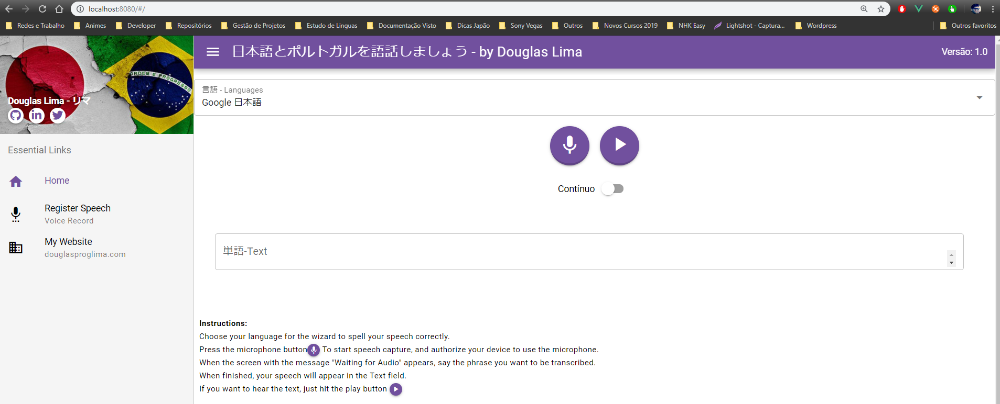
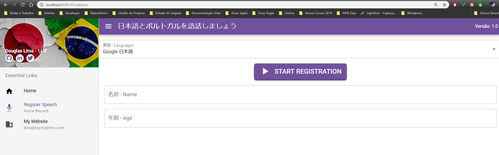
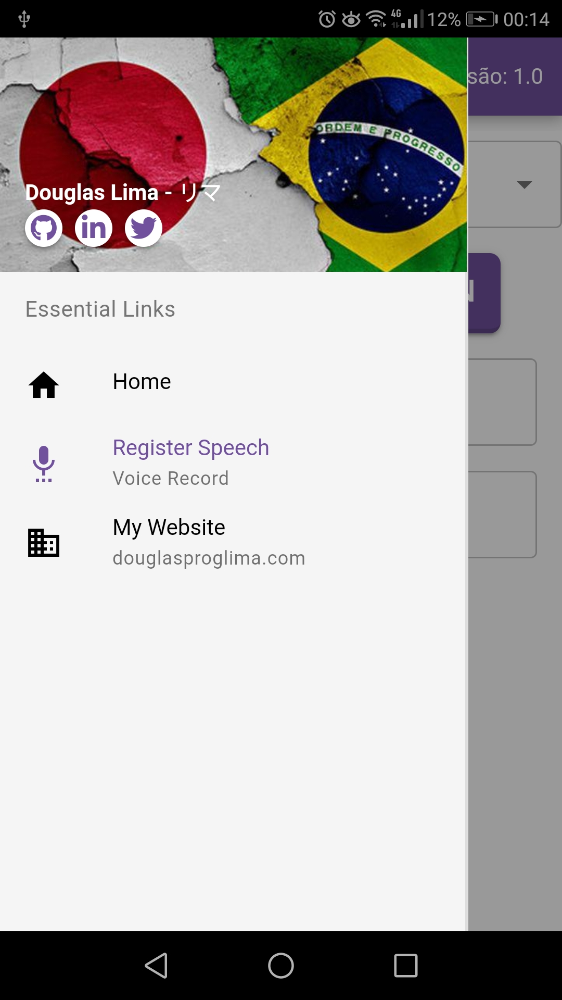
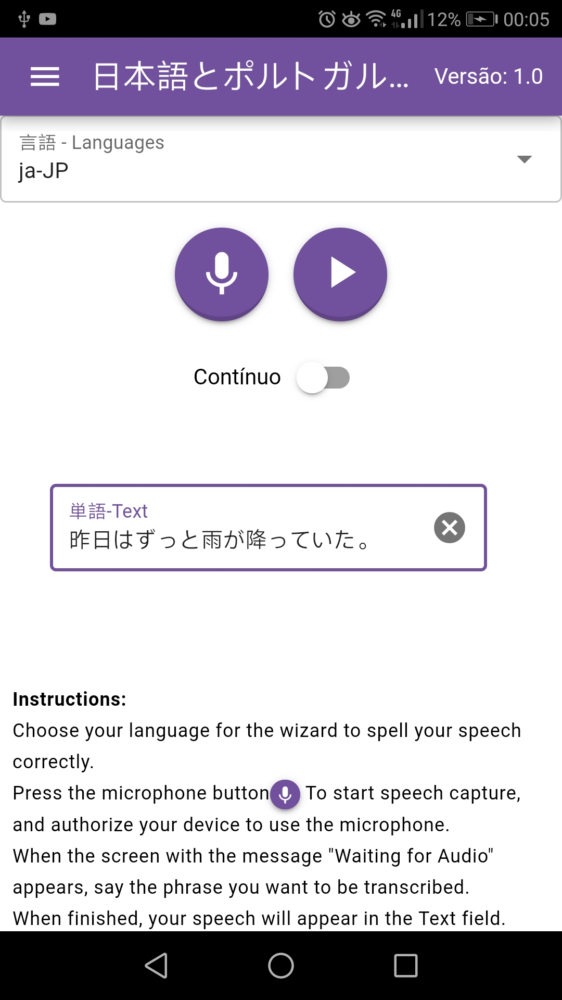
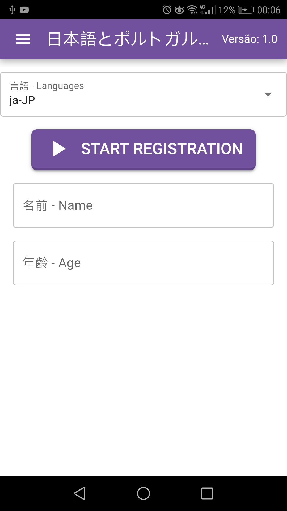

# 日本語とポルトガル語を話しましょう(Vamos conversar em Japonês e Português) com o Quasar + Speech API 

## SPA - Versão Web

## Aplicativo - Versão Android

Projeto de uma SPA/App Android desenvolvido com Quasar Framework + Speech API para capturar aúdio e transformar em texto, ou utilizar um texto como base para a aplicação e emitir um aúdio.

DEMO: Updando...... sem cash para comprar hospedagem na AWS.

O que foi utilizado nesse projeto:
* [SpeechSynthesisUtterance](https://developer.mozilla.org/pt-BR/docs/Web/API/SpeechSynthesisUtterance) - A SpeechSynthesisUtteranceinterface da Web Speech API representa uma solicitação de fala. Ele contém o contexto do que o serviço de fala deve ler e informações sobre como usa-lo (por exemplo, idioma, tom e volume).
* [SpeechRecognition ](https://developer.mozilla.org/pt-BR/docs/Web/API/SpeechRecognition) - A SpeechRecognitioninterface da Web Speech APIs a interface do controlador para o serviço de reconhecimento; isso também lida com o SpeechRecognitionEventenviado do serviço de reconhecimento.
* [Quasar Framework](https://quasar.dev/) - Escreva código uma vez e simultaneamente implante-o como um site, um aplicativo móvel e/ou um aplicativo electron(desktop). Sim, a mesma base de código para todos as plataformas(IOS, Android, Web e Descktop), ajudando você a desenvolver um aplicativo em tempo recorde usando um CLI de última geração e com o suporte de componentes da Web Quasar bem escritos e voltados para o desempenho.
